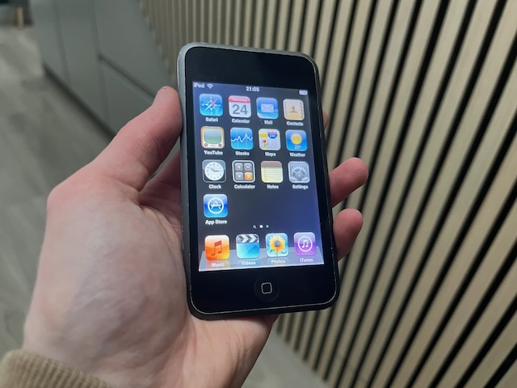
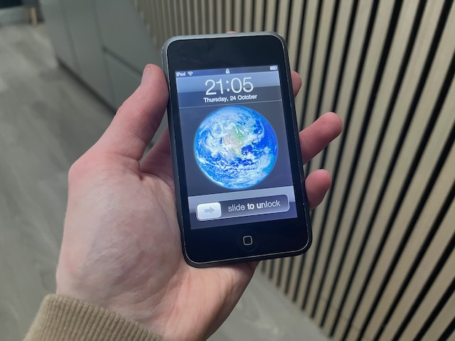

I recently snagged a 1st generation 2007 iPod Touch for €20 at CeX in Arklow.

## Restoration process
The iPod initially wouldn't boot into the OS. Let me tell you, restoring it was a nightmare.
- Apple does not have iPhone OS 3 on their servers anymore, so restoring via a Mac does not work
- Restoring on iTunes for Windows did not work either for the same reason. Even attempting to use an unmodified original IPSW file, it failed to flash on my device.

I had to use [Legacy iOS Kit](https://github.com/LukeZGD/Legacy-iOS-Kit) on my Mac to restore the iPod and bypass the activation process.

It was very simple and I was done within 5 minutes + it lets you use a jailbroken custom IPSW which jailbreaks the iPod, installs Cydia and lets me install my own IPA files with AppSync!

## Plans
The screen has black spots in the center, which indicates a swollen battery. A new battery for this iPod will be about €20. I'll get around to it eventually, since it's still working fine and holding a bit of a charge.

The back housing and screen are both pretty scratched. It doesn't affect functionality, but I may replace those in the future too.