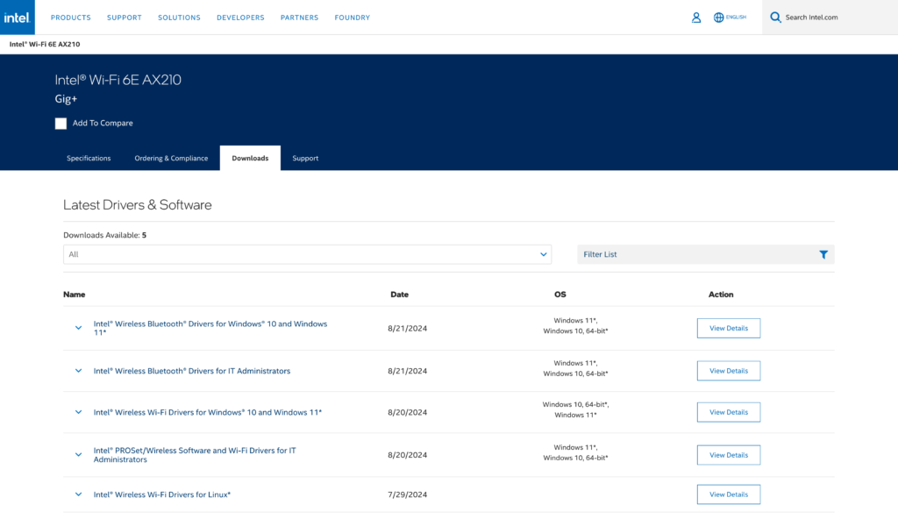

I recently purchased the SYONCON AXE5400 PCIe Wi-Fi card with the Intel AX210 chip to replace the aging and unreliable Fenvi T919 card in my PC.

The packaging is very clean and professional looking, unlike other similarly priced cards from other manufacturers on Amazon.

The box includes:

- A bag with screws to mount the card in place

- Screwdriver

- Two antennas

- The card itself

- Instruction pamphlet in multiple languages

Installing the card was a breeze, and installing the drivers was even easier. All I had to do was get the Intel wireless driver from their website, and install. It worked straight after.

Using the internet with this was such a relief after having to deal with the slow and outdated Wi-Fi card I had previously.

### Pros

- Drivers are official and easy to find

- The card is easy to install

- Works natively on Linux

- Bluetooth latency is great

### Cons

- Included antennas are quite weak

- Bluetooth audio can be a bit flakey

On average I get about 30-50mbps download, though I keep my desktop PC sitting next to my TV, which isn't exactly optimal for signal strength. Even with my PC sitting elsewhere, I don't always get full signal strength compared to my MacBook or iPhone.

Bluetooth audio works flawlessly apart from ocassional skipping and cutting out, but this also could be due to where I have my PC.

Support for the Intel chip was added in Linux Kernel version 5.10, so support out-of-the-box should be expected in any major distribution released within the last 4 years. For me, it worked straight away when using OpenSUSE Tumbleweed as of 30/08/24.

I'd highly recommend this card to anyone who does not currently have Wi-Fi on their PC, or they're looking for an easy solution to upgrade an older computer.
