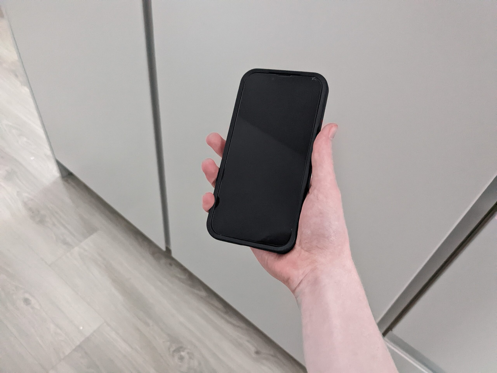
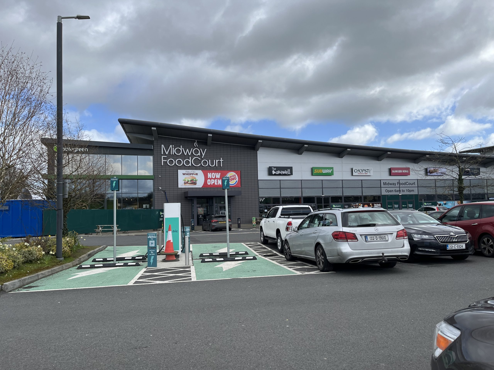

I recently got an iPhone 13 from [refurbed.ie](http://refurbed.ie), a refurbished electronics website, as an early birthday present.

As a lifelong Android user, I was curious to see what using an iPhone was like and how much it differed from my previous phone, a Google Pixel 6a.

### Setting it up

The setup process was pretty easy. Apple provides an app called "Move to iOS" that lets you transfer your data from an Android phone to an iPhone. My contacts, SMS messages, photos, videos and apps were transferred. Despite toggling the option to move my WhatsApp chats in the app, WhatsApp on the iPhone refused to see my chats at all. I ended up having to reset the iPhone and start the whole process all over again, after which WhatsApp worked perfectly. I still have no clue what could've caused this, but it was a little annoying.

### Impressions

<figure>

<figcaption>

This picture was taken on my Google Pixel 6a. Impressive, huh?!

</figcaption>

</figure>

The iPhone feels premium and well-made. I keep it in a pretty thick Otterbox case, so I wouldn't be particularly mad if it didn't. The front and back are glass, while the sides are made with anodised aluminum. It's pretty dense, yet it's somehow thinner than my Google Pixel.

Considering the age and condition of this phone, I am pleasantly surprised with its performance. It feels faster than my Google Pixel 6a, which released a year after the iPhone.

iOS is pretty simple and minimal. It has few customisation options, especially for the home screen, but I'm not too sad about that. I prefer simplicity over too many options. Adjusting to it did not take too long, as I already own a MacBook and am pretty familiar with the macOS interface. iOS feels like (and basically is) a heavily stripped down macOS.

### Camera

The camera quality on the iPhone 13 still holds up well even to this day. Photos are clear and are colour-accurate even in challenging shots.

I still feel like my Google Pixel was better with skin tone, but the overall quality of the iPhone's photos still beat the Pixel in most scenarios.

Below are two example photos taken with the iPhone. I haven't had many chances to use the camera yet, so I may update this post with more images later on.

<figure>

<figcaption>

The Midway service station in Portlaoise, taken at 1x zoom.

</figcaption>

</figure>

<figure>

<figcaption>

The puppy I helped rescue for my mother and her friend, taken at 2x zoom.

</figcaption>

</figure>

### My verdict

Personally, I have nothing I dislike about this phone or iOS itself. I know this might be strange coming from a former Android user, but that's the truth. I am perfectly happy with this phone and I hope it lasts me the next few years.
