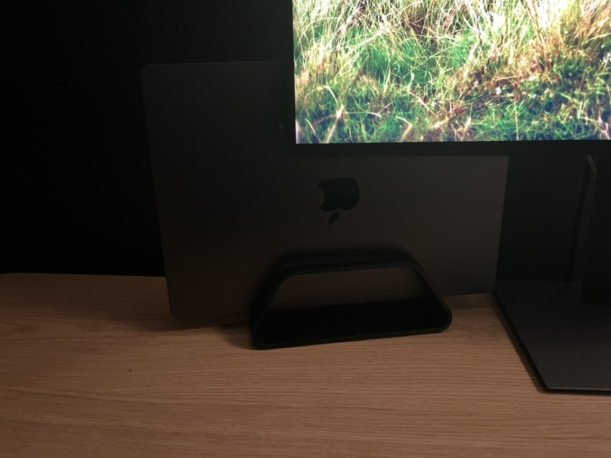
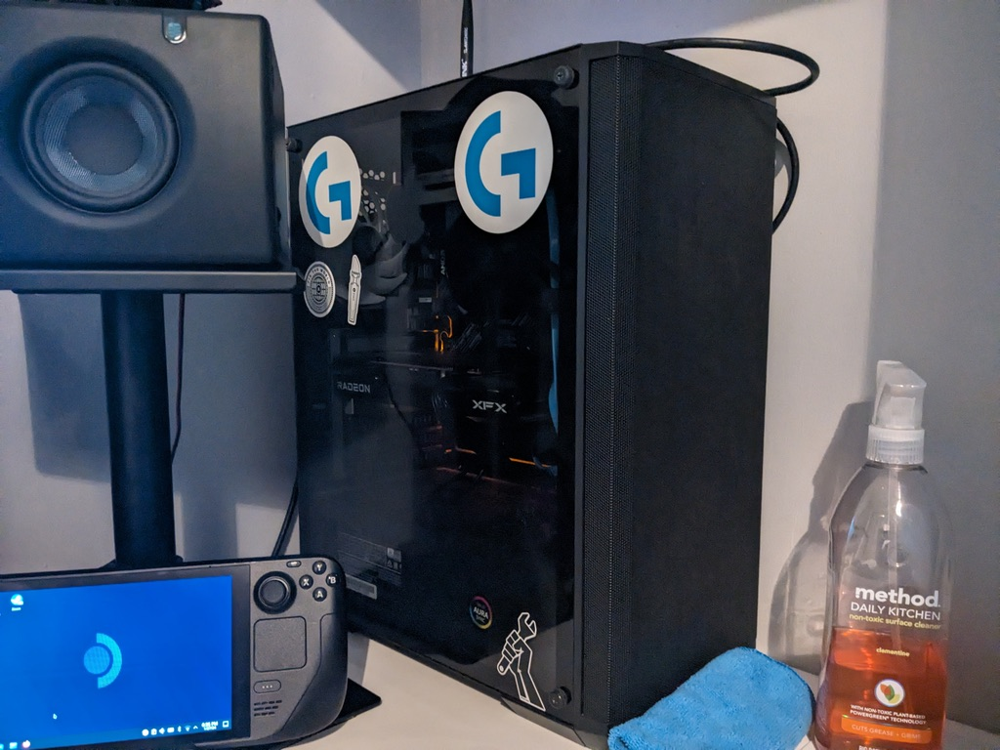
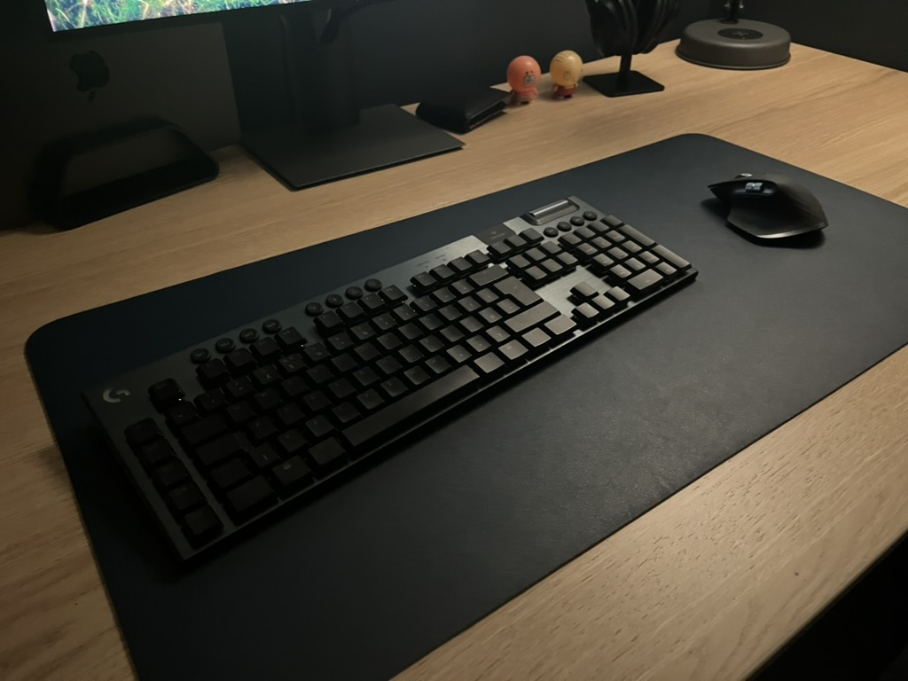
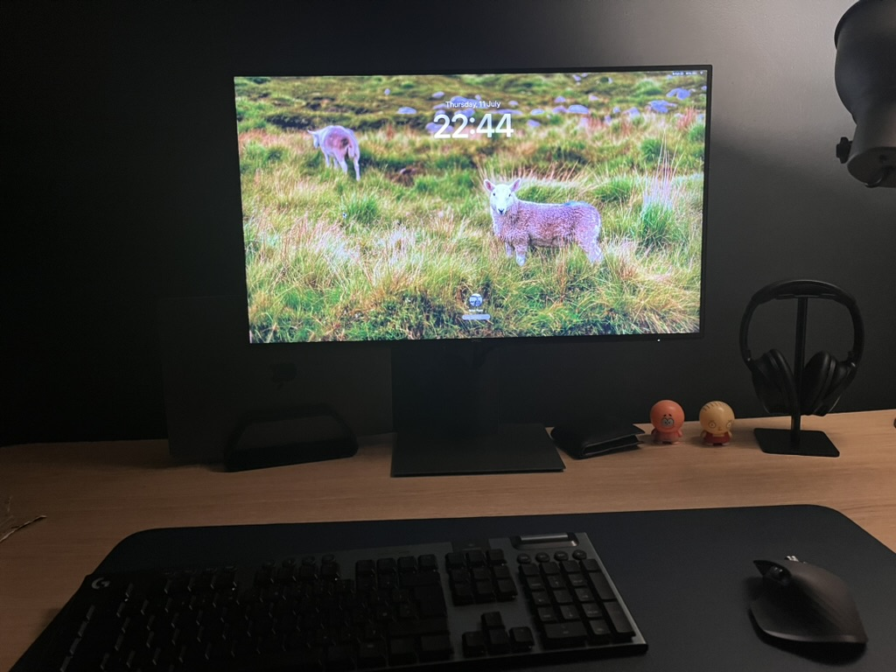
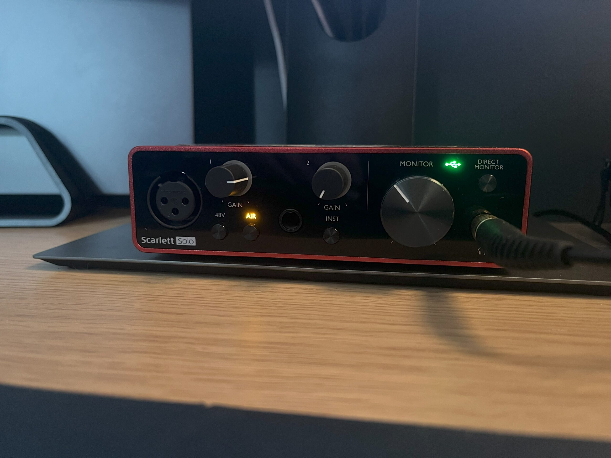

I use a MacBook Pro as my main computer. It's served me _very_ well for the past 7 months and I do not plan on upgrading or replacing it for possibly the next decade unless it breaks. I used to be quite anti-Apple, but since switching to a Mac, I finally understand why people love macOS; I can throw anything at it and it'll do it with no complaints, unlike Windows, which has gotten buggy and overly tedious to use, in my opinion.

<figure>

<figure>

<figcaption>

My MacBook Pro in its vertical stand

</figcaption>

</figure>

<figure>

<figcaption>

My PC, January 2024 (notice the white desk)

</figcaption>

</figure>

</figure>

Previously, I used a mid-range PC I built running Windows. That particular PC had its flaws but I loved it regardless. One thing I miss about using a PC is the ability to tinker and experiment with different operating systems, but I guess that's a compromise I have to make for a far better experience with my Mac.

I must say that I am, in no way, an Apple shill, nor am I a big-time fanboy. I just enjoy the products.

### Keyboard and mouse

My keyboard of choice is the Logitech G915. It's slim, with mechanical keys, and has full RGB. I had been previously using a cheaper "Havit" keyboard from Amazon, so this was a much needed upgrade.

For my mouse, I use the Logitech MX Master 3s. It's hands-down the best mouse I've ever used in my life. It has great ergonomics, quiet and soft buttons, and works especially well with my MacBook.

Underneath those two, I have a dark blue leather desk mat that a relative of mine gave to me some time ago. It's easy to clean and matches the wall behind the desk.

### Monitor

My monitor is the Dell UltraSharp U2721DE. I was eyeing up this particular one for its looks and USB hub functionality. I was shocked when I saw this exact model sitting on a shelf in my local CeX shop. I picked it up a few days later.

It's a 2560x1440, 60hz IPS panel with okay colour accuracy. When I had initially turned it on, it had a noticeable green tint that required me to manually change the colours in the options.

Because of how macOS handles display scaling for most resolutions, I had to install a third-party app called BetterDisplay to get my monitor to run at a high DPI.

### Audio interface

I use the Focusrite Scarlett Solo 3rd gen. It's works and does the job with absolutely zero hassle. I have not had one single problem. I got it a few years ago to replace the aging AKAI EIE Pro USB interface that had been given to me by my brother. That interface was very finicky and I felt like it was hit or miss on whether it would work or not.

### Speakers

The PreSonus Eris E3.5 (mine are the first generation ones) are fantastic speakers / studio monitors especially considering the price compared to some other monitors out there. I like the adjustable bass and treble knobs on the back to be able to tailor it to your specific environment.

They're sitting on top of some Millenium Desktop Monitor Stands that came bundled with them. They aren't pictured since I don't have room for them on my desk at the moment. Anyway, they're height adjustable but pretty bulky and probably a bit overkill for those speakers.

### Microphone

My microphone of choice in 2020 was the Samson Q2U. It's not really that exciting, it's just a microphone. It sounds decent and hasn't had any issues.

The arm is sitting on is a TONOR microphone boom arm. Works fine, although it needs a bit of a clean. It does squeak, and the springs make sound when they're being pulled, but I can't really complain considering how cheap it was.
