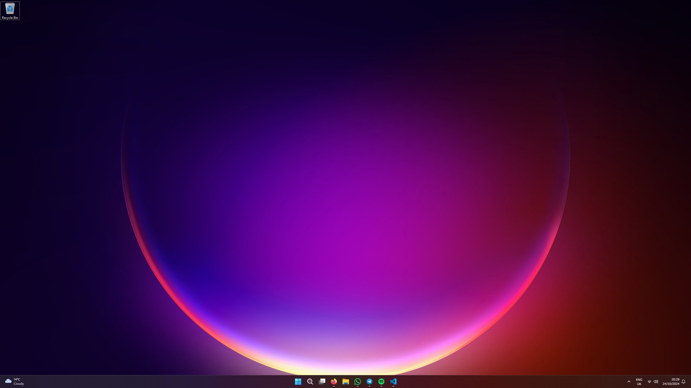

+++
title = "Tech"
type = "page"
+++

## My history with tech
# 2016
I got my first ever "laptop" for Christmas in 2016. It was a Kurio Smart 2-in-1 Windows tablet with 1 whole gigabyte of RAM, 32 gigabytes of storage, and an Intel Atom CPU.

# 2018
In the summer of 2018, I got my first proper laptop. An ASUS Vivobook X540UA with an Intel Core i5 7200U, 8GB of RAM, and 1TB of storage.

I'd eventually upgrade it to 16GB of RAM, along with a 500GB SSD, in 2020.

# 2021
For my 13th birthday, I'd get the opportunity to build my first ever PC. I went for a Ryzen 5 3600, ASUS Prime B550M-A motherboard, 16GB of RAM, GeForce GTX 1660, 500GB NVMe SSD, and a 500W PSU. It was a substantial upgrade from the laptop I had been using previously (which had integrated graphics, lol)

# 2023 - now
At the beginning of the 2023, I upgraded my PC to 32GB of RAM, and AMD Radeon RX 6600. I also got another 500GB NVMe drive for extra storage.

I started hackintoshing and used macOS as my primary OS on my PC over the summer.

In November, I got a MacBook Pro. This was my first time using actual Apple hardware as my primary computer. 

## My hardware
For more details, read [What's on my desk - 2024](../blog/whats-on-my-desk-2024/)

iPhone 13
- 256GB
- Midnight

MacBook Pro 14”
- M3 Pro (12/18c) CPU/GPU
- 18GB “Unified Memory”
- 1TB storage
- Space Black

PC (custom)
- ASUS Prime B550M-A motherboard
- AMD Ryzen 5 5600X CPU
- 32GB (4x8) 3200mhz DDR4 RAM
- 1x 500GB WD Blue NVMe SSD
- 1x 500GB Patriot P300 NVMe SSD
- XFX AMD Radeon RX 6600 GPU
- [SYONCON Intel AX210 Wi-FI card](../blog/syoncon-intel-ax210-pcie-wi-fi-card/)
- be quiet! Pure Power 11 500W PSU
- BitFenix Nova Mesh SE case

Accessories:
- SABRENT USB to SATA enclosure
- Sabrent 4 Port USB 3 Hub

Peripherals:
- Dell UltraSharp U2721DE monitor
- Logitech G915 Lightspeed keyboard
- Logitech MX Master 3S wireless mouse

Audio:
- Focusrite Scarlett Solo 3rd Gen interface
- Samson Q2U USB & XLR microphone
- TONOR microphone boom arm
- Samson SR850 headphones
- Bose QuietComfort 45 noise-cancelling headphones

## My software / OS
# PC

I use plain old Windows 11. Despite my dislike for Windows, I enjoy using it.

I used to run LTSC or debloated versions of Windows, but they provided no benefit for me and caused even more problems.

# Mac
I use macOS Seqouia. I love the interface and polish of macOS (Microsoft should take notes) 

# Applications I use
Firefox
- Speedy and clean browser. I've switched to Firefox completely after Google decided to remove MV3 support from Chrome, rendering extensions like uBlock Origin to cease working on Chrome.

Ableton Live 12
- Amazing DAW. I record and produce all of the music for my rap persona MC$COOL$BRI with this.

Affinity Designer
- Awesome graphic design software. I used this to make the old logo and all of the designs for BRIANS NEWS.

Davinci Resolve
- I got fed up with pirating Adobe Premiere Pro and decided to switch to Davinci Resolve earlier this year. Does everything I need it to, and very well.

Visual Studio Code
- I'm actually writing this in Visual Studio Code as of 24/10/24! Cool code editor. I still have lots to learn, but I'm enjoying it thus far